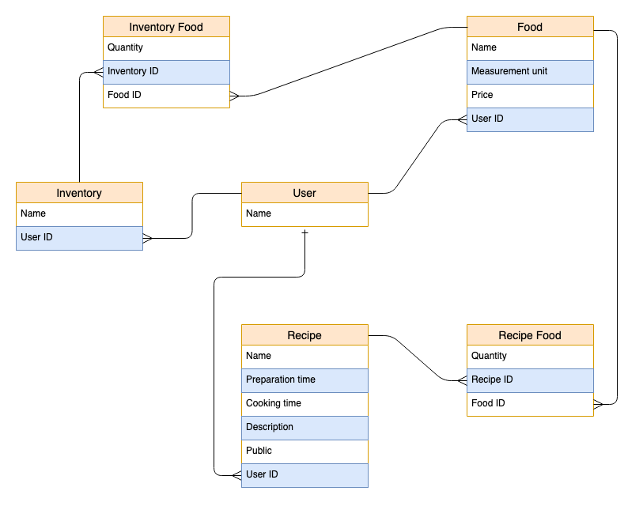

# Recipe App

> The Recipe app keeps track of all your recipes, ingredients, and inventory. It will allow you to save ingredients, keep track of what you have, create recipes, and generate a shopping list based on what you have and what you are missing from a recipe. Also, since sharing recipes is an important part of cooking the app should allow you to make them public so anyone can access them.

## Built With

- Ruby
- Ruby on Rails
- Postgresql
- Bootstrap

## Entity Relationship Diagram




## Getting Started

**To get a local copy up and running follow these simple example steps:**

### Prerequisites

- [Ruby](https://www.ruby-lang.org/en/)
- [Rails](https://gorails.com/)

### Setup

- Make sure you have Ruby on Rails set up properly on your computer

``` sh 
  git git@github.com:faizi2500/recipe-app.git
``` 
``` sh 
  cd blog-app
```

### Install

```sh
  bundle install
```

### Run

```
  rails db: create
```

```
  rails db:migrate
```

```
  rails s
```

### Test

```sh
  rspec
```
### Usage

To start recipe app you need to first `signup`

## Authors

👤 **Faizan Zahid**

- GitHub: [@faizi2500 ](https://github.com/faizi2500)
- Angelist: [@faizan_2500 ](https://angel.co/u/faizan2500)
- LinkedIn: [@faizan2500](www.linkedin.com/in/faizan2500)

👤 **Amine Smahi**

- GitHub: [@medaminedev66](https://github.com/medaminedev66)
- Twitter: [@medaminesmahi](https://twitter.com/medaminesmahi)
- LinkedIn: [Mohammed Amine Smahi ](https://www.linkedin.com/in/md-amine-smahi/)

👤 **Rida Arif**

- GitHub: [@ridaarif98](https://github.com/ridaarif98)
- Twitter: [@ridaarif](https://twitter.com/Rida29984906)
- LinkedIn: [Rida Arif](https://www.linkedin.com/in/rida-arif-90945520b/)

## 🤝 Contributing

Contributions, issues, and feature requests are welcome!

- Feel free to check the [issues page](https://github.com/faizi2500/recipe-app/issues).


## Show your support

- Give a ⭐️ if you like this project!


## Acknowledgments

- Microverse for giving us this chance


